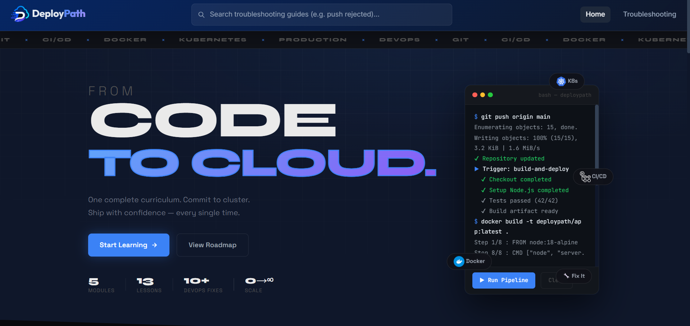
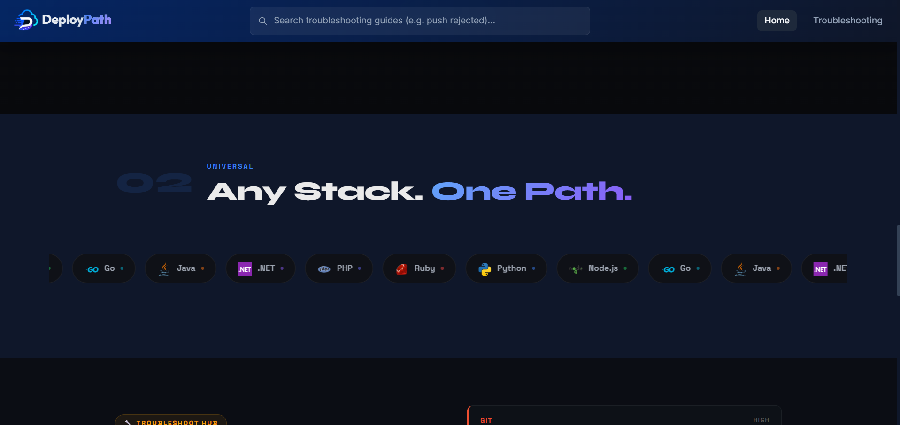
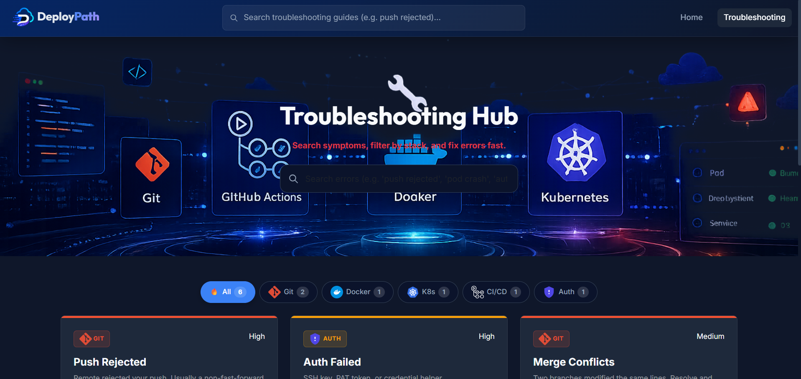
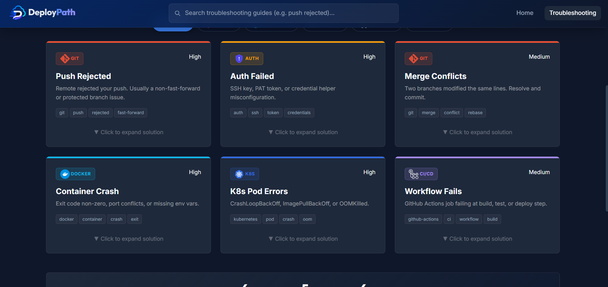

# DeployPath 🚀

**Your step-by-step guide to deploy applications from local machine to the Cloud.**

A Blazor WebAssembly documentation platform designed to help junior developers and "vibe coders" master modern deployment workflows using **Git, Docker, GitHub Actions, and Kubernetes**.

---

## ✨ Features

- **Clear Learning Roadmap** – Visual step-by-step path from zero to production
- **Interactive Guides** – Detailed tutorials with code snippets, commands, and explanations
- **Real-World Focus** – Practical deployment scenarios for Blazor and other web apps
- **Static & Fast** – Built with Blazor WebAssembly for excellent performance
- **Data-Driven Content** – Roadmap and guides loaded from JSON for easy maintenance

## 🛠 Tech Stack

- **Frontend**: Blazor WebAssembly (.NET 10)
- **Styling**: CSS + Bootstrap
- **Deployment**: GitHub Pages / Azure Static Web Apps
- **CI/CD**: GitHub Actions

## 📁 Project Structure
```
DeployPath/
├── DeployPathBlazor/              # Main Blazor WebAssembly project
│   ├── Components/                # Reusable UI components
│   ├── Layout/                    # Layout components
│   ├── Models/                    # Data models
│   ├── Pages/                     # Main pages & tutorials
│   └── wwwroot/
│       ├── data/                  # JSON files for roadmaps & guides
│       └── ...                    # CSS, images, etc.
├── .gitignore
└── DeployPath.slnx
```
---
## 📷 Screenshots
<div>
  
  
  
  
</div>

## 🚀 Getting Started
### Prerequisites
- Visual Studio 2022 or VS Code with C# extension

### Run Locally

```bash
# Clone the repository
git clone https://github.com/medjmal54/DeployPath.git
cd DeployPath

# Navigate to the Blazor project
cd DeployPathBlazor

# Run the application
dotnet run
```
Open your browser and go to https://localhost:5xxx

<h2>📖 How to Use</h2>
<ol>
  <li>Start with the Roadmap page</li>
  <li>Follow each step in order</li>
  <li>Use the provided code snippets and commands</li>
  <li>Deploy your own projects as you learn</li>
</ol>

<h2>🎯 Goals</h2>
<ul>
  <li>Help junior developers ship their projects confidently</li>
  <li>Demystify Docker, CI/CD, and Kubernetes</li>
  <li>Provide high-quality, free learning resources</li>
</ul>

<h2>📄 License</h2>
This project is open source.
